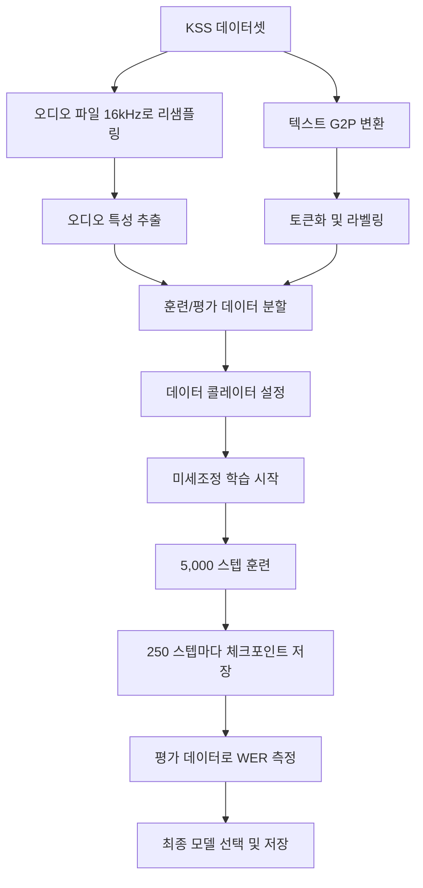
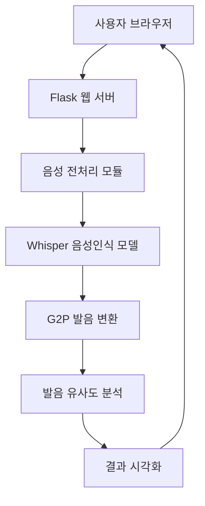

# Whisper Pronouncer KR

한국어 발음 교정을 위한 웹 애플리케이션입니다.

## 📋 프로젝트 개요

이 프로젝트는 사용자가 업로드한 음성 파일의 발음을 분석하고, 원본 문장과 비교하여 발음 정확도를 평가하는 웹 애플리케이션입니다. 한국어에 특화된 Whisper 모델을 사용하여 음성을 텍스트로 변환하고, G2P(Grapheme to Phoneme) 변환기를 이용해 발음 유사도를 계산합니다.

## 🚀 주요 기능

- WAV 파일 업로드 및 처리
- 원본 문장과 음성 인식 결과 비교
- 한국어 발음 유사도 분석 및 점수화
- 직관적인 웹 인터페이스

## 💻 기술 스택

- **백엔드**: Flask
- **AI 모델**: Whisper-small (한국어 미세조정)
- **주요 라이브러리**:
  - transformers
  - torch
  - g2pk
  - librosa
  - torchaudio

## 🤖 모델 구조 및 학습 방법

### 사용된 베이스 모델
프로젝트에서는 OpenAI의 Whisper-medium 모델을 시작점으로 사용하여 한국어에 특화된 모델로 미세 조정했습니다. Whisper는 다양한 오디오 작업을 위한 강력한 Transformer 기반 인코더-디코더 모델입니다.

### 데이터 전처리
- KSS(Korean Single Speaker Speech Dataset)의 12,853개 오디오 파일을 사용
- 모든 오디오를 16kHz로 표준화
- 훈련/평가 데이터셋을 9:1 비율로 분할
- **G2P 변환 적용**: 텍스트를 실제 발음 형태로 변환
  - 예: `밥을 먹다` → `바블 먹따`
  - 예: `읽다와 일다` → `익따와 일다`
  - 예: `김치찌개` → `김치찌개`

이러한 G2P 전처리는 한국어의 특성상 표기와 실제 발음 사이의 차이를 모델이 학습할 수 있도록 도와줍니다. 특히 받침의 발음 변화, 연음 현상 등을 처리합니다.

### 모델 학습 과정



### 학습 방법
- **훈련 전략**: Step 기반 학습 (epoch가 아닌 step 수로 훈련)
- **배치 크기**: 1 (gradient accumulation steps: 4)
- **학습률**: 5e-5
- **최대 훈련 스텝**: 5,000
- **최적화**: Mixed precision (FP16) 사용
- **모델 저장**: 매 250스텝마다 체크포인트 저장 및 평가

### 모델 특징
- 한국어 발음 인식에 최적화
- 특수 토큰 제한 해제 (forced_decoder_ids=None, suppress_tokens=[])
- 한국어 발음 특성에 맞게 미세 조정

### 추론 프로세스
1. 입력 오디오가 16kHz로 변환됨
2. Whisper 프로세서를 통해 오디오 특성 추출
3. 모델이 추출된 특성을 사용하여 텍스트 시퀀스 생성
4. G2P 변환기를 사용하여 발음 형태로 변환
5. 원본 문장의 발음과 비교하여 유사도 계산

## 🏗️ 시스템 아키텍처



이 시스템은 다음과 같은 단계로 작동합니다:

1. 사용자가 웹 브라우저에서 음성 파일을 업로드하고 원본 문장을 입력합니다
2. Flask 웹 서버가 요청을 받아 처리합니다
3. 음성 전처리 모듈(resamplerate.py)에서 파일을 16kHz로 리샘플링합니다
4. 미세조정된 Whisper 모델이 음성을 텍스트로 변환합니다
5. G2P 변환기가 텍스트를 발음 형태로 변환합니다
6. 발음 유사도 분석 모듈(similarity.py)에서 원본과 인식된 발음을 비교합니다
7. 분석 결과를 사용자에게 시각적으로 표시합니다

## 🛠️ 설치 및 실행 방법

### 1. 모델 다운로드

[Hugging Face](https://huggingface.co/donaldsuk/whisper-ko)에서 모델을 다운로드하여 프로젝트 루트의 `whisper_step_output` 폴더에 저장합니다.

```
whisper-ko-web/
├── whisper_step_output/
│   ├── config.json
│   ├── preprocessor_config.json
│   ├── pytorch_model.bin
│   └── tokenizer_config.json
```

### 2. 의존성 설치

```bash
pip install -r requirements.txt
```

### 3. 애플리케이션 실행

```bash
python app.py
```

## 📊 성능 지표

- **WER (Word Error Rate)**: 약 2.8%
- **학습 데이터**: KSS (Korean Single Speaker Speech Dataset)
- **특징**: 발음 기반 G2P 라벨 전처리, step 기반 학습

## 🧪 테스트 예시 문장

다음 문장들로 발음 교정 성능을 테스트해 볼 수 있습니다:

- "밥솥이 터질 뻔했어"
- "읽다와 일다의 차이를 알아?"
- "닭과 달걀은 비슷하게 생겼지만 다르다"

## 👤 개발자 정보

- Hugging Face: [donaldsuk](https://huggingface.co/donaldsuk)
- GitHub: [github.com/donaldsuk](https://github.com/donaldsuk)

## 🔗 참고 및 사용된 자료

- [korean_apparent_similarity](https://github.com/goonbamm/korean_apparent_similarity): 한국어 외형 유사도 계산에 사용된 `similarity.py` 코드의 원본 저장소입니다. 한글 자모를 분리하고 유사도를 계산하는 알고리즘을 제공합니다.
- [KSS Dataset](https://huggingface.co/datasets/Bingsu/KSS_Dataset): 프로젝트의 음성 인식 모델 학습에 사용된 한국어 단일 화자 음성 데이터셋입니다. 약 12,853개의 한국어 오디오 파일과 스크립트로 구성되어 있으며, 전문 여성 성우의 음성으로 녹음되었습니다. 이 데이터셋은 Kyubyong Park에 의해 제작되었으며 NC-SA 4.0 라이센스를 따릅니다.

## 📝 라이센스

MIT 라이센스
