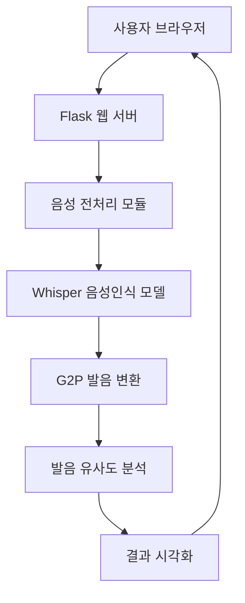

# Whisper Pronouncer KR

한국어 발음 교정을 위한 웹 애플리케이션입니다.

## 📋 프로젝트 개요

이 프로젝트는 사용자가 업로드한 음성 파일의 발음을 분석하고, 원본 문장과 비교하여 발음 정확도를 평가하는 웹 애플리케이션입니다. 한국어에 특화된 Whisper 모델을 사용하여 음성을 텍스트로 변환하고, G2P(Grapheme to Phoneme) 변환기를 이용해 발음 유사도를 계산합니다.

## 🚀 주요 기능

- WAV 파일 업로드 및 처리
- 원본 문장과 음성 인식 결과 비교
- 한국어 발음 유사도 분석 및 점수화
- 직관적인 웹 인터페이스

## 💻 기술 스택

- **백엔드**: Flask
- **AI 모델**: Whisper-small (한국어 미세조정)
- **주요 라이브러리**:
  - transformers
  - torch
  - g2pk
  - librosa
  - torchaudio

## 🏗️ 시스템 아키텍처



이 시스템은 다음과 같은 단계로 작동합니다:

1. 사용자가 웹 브라우저에서 음성 파일을 업로드하고 원본 문장을 입력합니다
2. Flask 웹 서버가 요청을 받아 처리합니다
3. 음성 전처리 모듈(resamplerate.py)에서 파일을 16kHz로 리샘플링합니다
4. 미세조정된 Whisper 모델이 음성을 텍스트로 변환합니다
5. G2P 변환기가 텍스트를 발음 형태로 변환합니다
6. 발음 유사도 분석 모듈(similarity.py)에서 원본과 인식된 발음을 비교합니다
7. 분석 결과를 사용자에게 시각적으로 표시합니다

## 🛠️ 설치 및 실행 방법

### 1. 모델 다운로드

[Hugging Face](https://huggingface.co/donaldsuk/whisper-ko)에서 모델을 다운로드하여 프로젝트 루트의 `whisper_step_output` 폴더에 저장합니다.

```
whisper-ko-web/
├── whisper_step_output/
│   ├── config.json
│   ├── preprocessor_config.json
│   ├── pytorch_model.bin
│   └── tokenizer_config.json
```

### 2. 의존성 설치

```bash
pip install -r requirements.txt
```

### 3. 애플리케이션 실행

```bash
python app.py
```

## 📊 성능 지표

- **WER (Word Error Rate)**: 약 2.8%
- **학습 데이터**: KSS (Korean Single Speaker Speech Dataset)
- **특징**: 발음 기반 G2P 라벨 전처리, step 기반 학습

## 🧪 테스트 예시 문장

다음 문장들로 발음 교정 성능을 테스트해 볼 수 있습니다:

- "밥솥이 터질 뻔했어"
- "읽다와 일다의 차이를 알아?"
- "닭과 달걀은 비슷하게 생겼지만 다르다"

## 👤 개발자 정보

- Hugging Face: [donaldsuk](https://huggingface.co/donaldsuk)
- GitHub: [github.com/donaldsuk](https://github.com/donaldsuk)

## 📝 라이센스

MIT 라이센스
